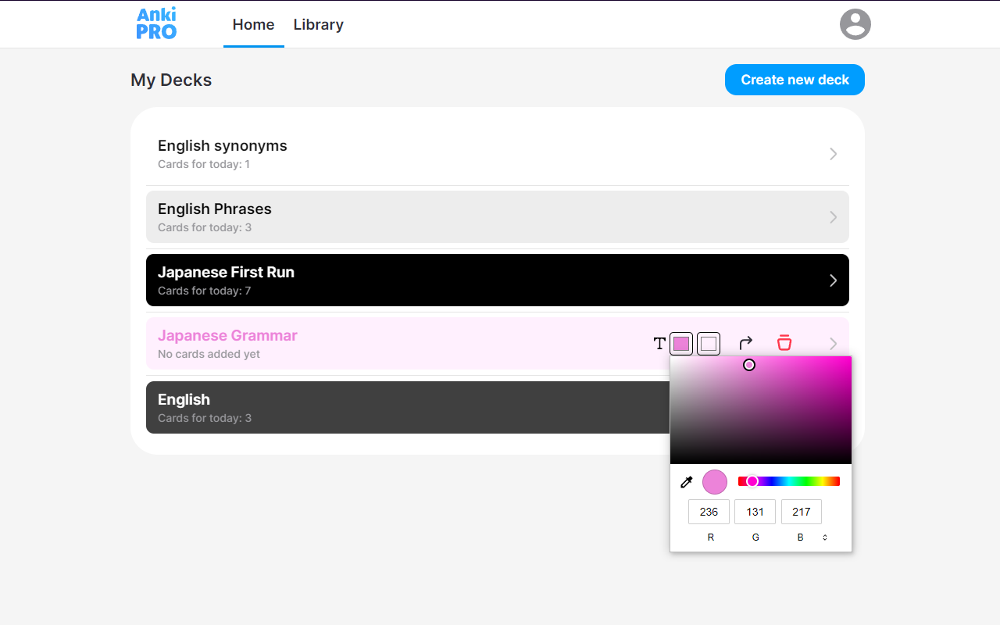

#Color Picker for AnkiPro flashcards decks
##Description
Is an extension that adds a colour choice option for your flashcards decks on AnkiPro.net. 
Install it if you want to customize your decks a bit.
##Installation
1. Download AnkiProColorSelector.crx.
2. Open the Google Chrome browser and go to chrome://extensions/.
3. Simply drag and drop AnkiProColorSelector.crx into your browser. Done!
##Screenshots

##Usage
1. Hover on deck.
2. Select text and background colour. Finished!
